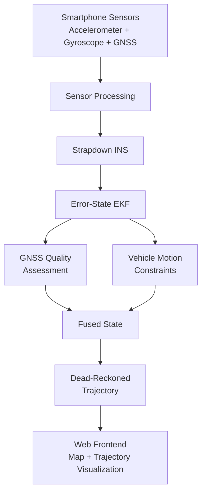
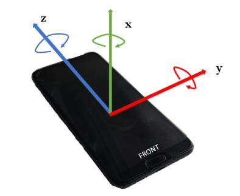
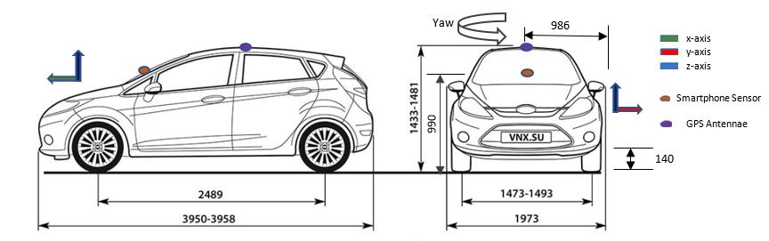
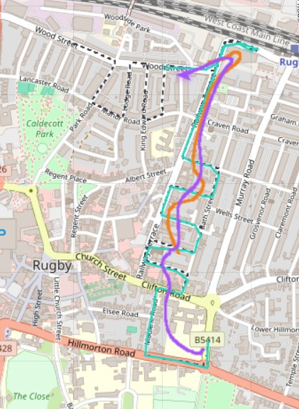
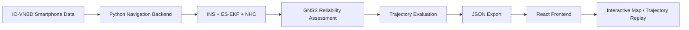

# AERIS
**AI-Enhanced Resilient Inertial System**

> A smartphone-based intelligent dead-reckoning navigation system that maintains vehicle positioning during GNSS/GPS outages using inertial sensing, physics-based constraints, GNSS reliability assessment, and sensor fusion.

Built for **Smart India Hackathon 2026**, addressing the ISRO problem statement on ground-vehicle positioning without OBD-II or dedicated vehicle hardware. *(Independent student project developed for SIH 2026 — not an official ISRO deliverable.)*

*Previously developed under the working name "Intelligent Dead Reckoning Navigation System" — AERIS is the project's identity going forward.*

---

## The Problem

Modern vehicle navigation depends heavily on GNSS/GPS. But GNSS can become unreliable or unavailable in:

- Tunnels
- Urban canyons (dense high-rise areas)
- Signal obstruction
- Interference or jamming
- Temporary satellite degradation

When that happens, conventional navigation can freeze, jump, or become inaccurate.

**The key challenge:** How can a vehicle continue estimating its position when GNSS disappears — without depending on OBD-II or dedicated vehicle hardware?

## Our Approach

AERIS uses a smartphone's own IMU sensors (accelerometer + gyroscope) combined with inertial navigation mathematics, physical constraints of how a ground vehicle actually moves, and an Error-State Extended Kalman Filter to maintain a continuous position estimate. A rule-based GNSS reliability layer continuously decides how much to trust incoming GPS data, so the system degrades gracefully instead of freezing or jumping when signal quality drops. The result: positioning that survives a real GNSS outage using nothing but phone-grade sensors.

---

## System Overview



**Sensors → Intelligence/Fusion → Position Estimate → Frontend.**

---

## Core Algorithms & Intelligence

AERIS is not "GPS plus an accelerometer." Every component below is genuinely implemented and tested — not planned, not simulated.

**Strapdown Inertial Navigation System (INS)** — IMU measurements are integrated to propagate position, velocity, and orientation forward in time. This is what keeps the system moving when GNSS goes silent.

**15-State Error-State Extended Kalman Filter (ES-EKF)** — Rather than tracking raw position/velocity/attitude directly, the filter tracks the *error* in each: position (3), velocity (3), attitude (3), accelerometer bias (3), gyroscope bias (3). This is the mathematically correct formulation for navigation filtering — it avoids attitude singularities and stays numerically stable through sharp turns.

**Quaternion Attitude Representation** — Orientation is stored as a quaternion rather than raw Euler angles, avoiding gimbal-lock singularities that would otherwise corrupt heading during aggressive maneuvers.

**Non-Holonomic Constraints (NHC)** — A ground vehicle cannot slide sideways or fly vertically. This physical fact is fed into the filter as a correction whenever GNSS is degraded or unavailable, and alone accounts for the majority of drift reduction during an outage.

**Zero-Velocity Update (ZUPT)** — When the vehicle is confirmed stationary (e.g. at a traffic light), velocity is known to be exactly zero. This corrects accumulated velocity drift for free.

**Zero Angular-Rate Update (ZARU)** — At the same confirmed-stationary moments, the gyroscope reading is almost entirely bias. This directly corrects gyroscope bias, bounding heading drift over the following stretch of driving.

**Rule-Based GNSS Reliability Classifier** — Every GPS reading is assessed using satellite count, reported accuracy, position-jump magnitude, and the EKF's own innovation (how far a GPS fix is from what the filter predicted). Readings are labeled healthy / degraded / unavailable, and the filter's trust in GPS scales accordingly.

**Outage Simulation & Multi-Scenario Evaluation** — GNSS outages are deliberately simulated at multiple durations (30s / 60s / 120s) on real recorded driving data, so the system's behavior under signal loss can be measured directly rather than assumed.

**RTS (Rauch-Tung-Striebel) Offline Smoother** — A backward post-processing pass over a completed, recorded drive. Because it can use information from *after* an outage ends (GNSS reacquisition) to refine the estimate *during* the outage, it produces a measurably tighter trajectory than the real-time filter — but it is explicitly an offline analysis capability, not something a live phone could compute, and is presented as a clearly separate layer for exactly that reason.

---

## How AERIS Works

1. **Smartphone sensing** — Read accelerometer, gyroscope, and GNSS data (IMU at ~10 Hz, GNSS at ~1 Hz).
2. **Inertial propagation** — IMU measurements continuously propagate position, velocity, and attitude forward.
3. **GNSS assessment** — Each GNSS reading is classified healthy / degraded / unavailable.
4. **Error correction** — The 15-state ES-EKF estimates and corrects navigation errors using whichever measurements are currently available.
5. **Vehicle motion constraints** — NHC (lateral/vertical velocity ~ 0) and ZUPT/ZARU (at confirmed stops) apply whenever relevant.
6. **Continuous positioning** — When GNSS is available, it corrects drift. When GNSS disappears, inertial propagation plus vehicle constraints carry the trajectory forward.
7. **Frontend visualization** — The resulting trajectory is exported as JSON and consumed by the web frontend for interactive replay and comparison.

---

## Dataset: IO-VNBD

AERIS is developed and evaluated on **IO-VNBD** (Inertial and Odometry Benchmark Dataset for Ground Vehicle Positioning; Onyekpe et al., Coventry University) - approximately 100 hours of real driving across the UK, Nigeria, and France, recorded with both a dedicated vehicle logger and a smartphone.

- **`V-*` files** — from a dedicated VBOX GPS+CAN logger. Used **only as a reference trajectory for evaluation.** We deliberately call this "reference," not "ground truth" — it is a dedicated GPS logger, not RTK-grade, and we do not overclaim its precision.
- **`S-*` files** — from a smartphone (AndroSensor app) mounted in the vehicle. This is the **actual input AERIS processes** — it is exactly what a real phone would see, matching the problem statement directly.

**Sequences used:** `S3b` (Driver A, Rugby — 11.4 minutes, repeated turns, used for development) and `S1` (Driver A, Coventry — 86 minutes, used as an **unseen validation sequence**, evaluated once with zero parameter changes).

Full column reference and terminology decisions: [`docs/DATASET.md`](docs/DATASET.md).

### Original IO-VNBD reference material

The dataset's own paper documents the smartphone's sensor axis convention and its physical placement in the vehicle — both directly relevant to how AERIS interprets raw IMU readings (this is the exact axis convention that determines correct gyroscope-to-body-frame mapping in the INS).

> **Smartphone sensor axis convention (IO-VNBD paper, Figure 2)**
> 

> **Sensor placement and vehicle dimensions (IO-VNBD paper, Figure 3)**
> 

*(The IO-VNBD paper does not include a plotted reference-trajectory figure — the images above are the genuinely relevant original figures it contains.)*

---

## From Sensor Data to a Working Navigation Interface

The backend processes smartphone sensor data, performs navigation estimation and outage evaluation, and exports the resulting trajectory as structured JSON. The frontend consumes this generated data and renders the vehicle trajectory on an interactive map, over real map tiles, with the vehicle's actual GPS coordinates.

> **AERIS dashboard — live trajectory replay on real map tiles (Rugby, UK — S3b sequence)**
> 
>
> Teal (dashed) = reference trajectory · Orange = AERIS real-time fused output · Purple = offline RTS-refined trajectory. The visible divergence in the upper section is the simulated GNSS outage window — exactly where dead reckoning is doing the work.



The frontend currently renders **four independently toggleable layers**: the reference trajectory, raw smartphone GNSS, the real-time AERIS fused output, and the offline RTS-refined trajectory (clearly labeled as post-processed, not live).

---

## Results

All figures below are from the `S3b` development sequence, 60-second simulated GNSS outage, unless stated otherwise.

| Approach | Mean Error | Max Error | What it shows |
|---|---|---|---|
| Raw inertial only (no correction) | ~12,600 m | ~29,000 m | Uncorrected sensor drift makes the vehicle "arrive" kilometres from reality within a minute |
| **AERIS - Real-Time** (ES-EKF + NHC + GNSS classifier) | **85.8 m** | **179.3 m** | Causal — exactly what a live phone running this system could compute |
| **AERIS - Offline-Refined** (+ RTS smoothing + ZARU) | **51.9 m** | **137.2 m** | Post-processed using the complete recorded drive — analysis capability, not a live claim |

> On a phone-only sensor budget (no wheel odometry, no OBD-II — the exact constraint this problem requires), raw inertial navigation is effectively unusable within a minute of GNSS loss. AERIS's real-time system keeps the vehicle positioned within roughly two football fields of the truth through the same outage.

### Validation on an unseen sequence

The same pipeline, with **zero parameter changes**, was evaluated on `S1` — a second, independent 86-minute sequence never used during development.

| Sequence | Duration | Role | Real-Time Mean Error | Offline-Refined Mean Error |
|---|---|---|---|---|
| S3b | 11.4 min | Development | 85.8 m | 51.9 m |
| **S1** | 86 min | **Unseen validation** | 166.5 m | **51.5 m** |

The offline-refined result lands at nearly the same absolute accuracy on both sequences (51.9 m vs. 51.5 m) despite S1 being eight times longer and never tuned on. This is evidence the approach generalizes to conditions it wasn't developed against — not a claim of universal generalization beyond what was actually tested.

### Multi-duration outage testing

The system was additionally evaluated with simulated GNSS outages of **30, 60, and 120 seconds** on the development sequence, to confirm results are not specific to one arbitrarily chosen outage length. *(Full current numbers: regenerate with `python backend/outage_analysis.py` and see [`docs/PROJECT_LOG.md`](docs/PROJECT_LOG.md) for the most recent run.)*

---

## Why AERIS Matters

- **No OBD-II dependency** — designed entirely around smartphone sensing.
- **GNSS-outage resilience** — continues estimating position using inertial sensing and vehicle constraints, not just GPS.
- **Hybrid approach** — combines classical navigation and filtering theory with a GNSS reliability intelligence layer.
- **Evidence-driven evaluation** — tested across multiple outage durations and validated on an unseen sequence, not just demoed once.

## What Makes Our Approach Different

**GNSS-only** — Accurate when GNSS is healthy, but vulnerable and effectively blind during outages or degradation.

**Raw inertial dead reckoning** — Can operate without GNSS, but errors accumulate rapidly (position error grows with the square of time for a constant sensor bias).

**AERIS** — Combines inertial propagation, GNSS corrections when reliable, GNSS reliability assessment, vehicle motion constraints, and error-state Kalman filtering into one system that degrades gracefully instead of failing outright.

---

## Technical Architecture

AERIS's backend converts GNSS coordinates to a local ENU (East-North-Up) metre-based frame before any filtering, so the estimator never mixes degrees and metres. A strapdown INS propagates the nominal navigation state (position, velocity, quaternion attitude, accelerometer/gyroscope bias) using raw IMU measurements. A 15-state error-state EKF estimates and corrects errors in that state using whichever measurements are currently available — GNSS position/velocity, non-holonomic constraints, or zero-velocity/zero-angular-rate updates at confirmed stops. A rule-based classifier continuously assesses GNSS reliability and scales the filter's trust in incoming GPS accordingly. Outage scenarios are simulated directly on recorded data for controlled evaluation, and an offline RTS smoother provides a separate, clearly-labeled refined trajectory using the complete recorded drive. Results are exported as structured JSON and consumed by a React/Vite/Leaflet frontend for interactive map-based replay.

Full mathematical derivations, state definitions, and covariance propagation details: [`docs/ARCHITECTURE.md`](docs/ARCHITECTURE.md).

---

## What We Built

| Component | What it does | Status |
|---|---|---|
| IO-VNBD data pipeline | Loads and processes smartphone/reference sensor data | Done |
| Strapdown INS | Propagates the inertial navigation state | Done |
| 15-state ES-EKF | Estimates and corrects navigation errors | Done |
| Quaternion attitude | Stable orientation representation, no singularities | Done |
| Non-Holonomic Constraints | Constrains physically impossible vehicle motion | Done |
| ZUPT / ZARU | Corrects velocity and gyro-bias drift at confirmed stops | Done |
| GNSS Reliability Classifier | Detects degraded/unavailable GNSS, scales filter trust | Done |
| Outage evaluation (30/60/120s) | Tests controlled GNSS outages on real data | Done |
| RTS offline smoother | Post-processed, clearly-labeled refined trajectory | Done |
| JSON trajectory export | Supplies navigation output to the frontend | Done |
| Frontend map (Leaflet, real tiles) | Interactive trajectory replay, 4 toggleable layers | Done |
| Backend to Frontend integration | Frontend consumes real, verified backend-generated data | Done |
| 161-test automated suite | Covers math, INS, EKF mechanics, classifier, pipeline, JSON schema | Done |

---

## Repository Structure

```
AERIS/
|-- backend/           # Python navigation pipeline (INS, ES-EKF, evaluation, tests)
|   |-- tests/          # 161-test automated suite
|   `-- exports/         # Generated trajectory JSON and evaluation results
|-- frontend/          # React + Vite + Leaflet interactive dashboard
|-- docs/              # Architecture, dataset reference, project log, and other documentation
|-- requirements.txt   # Backend Python dependencies
`-- README.md
```

---

## Current Status

**Completed**
- Full backend navigation pipeline (INS, ES-EKF, NHC, ZUPT/ZARU, GNSS classifier)
- Offline RTS smoothing with a locked, honest real-time/offline presentation split
- Frontend dashboard with real backend data across all four trajectory layers
- Evaluation on a development sequence and an independent unseen validation sequence
- Automated test suite (161 tests)

**Demonstrated**
- Generalization from an 11-minute development sequence to an 86-minute unseen sequence with zero parameter re-tuning
- Graceful degradation under simulated GNSS outages of varying duration

**Future Work** *(intentionally outside current MVP scope, not missing core functionality)*
- On-device Android sensor capture (current scope is dataset-driven, not live-phone)
- HMM-based map matching to constrain position to the road network
- Fixed-lag smoothing to bring part of the offline-refinement benefit closer to real time
- Magnetometer-aided heading correction (deferred — in-vehicle magnetic distortion is a real risk, not attempted for this MVP)

---

## Documentation

- [`docs/PROJECT_BRIEF.md`](docs/PROJECT_BRIEF.md) — problem, approach, and status
- [`docs/ARCHITECTURE.md`](docs/ARCHITECTURE.md) — full pipeline, module breakdown, math
- [`docs/ROADMAP.md`](docs/ROADMAP.md) — sprint plan and production roadmap
- [`docs/PROJECT_LOG.md`](docs/PROJECT_LOG.md) — chronological decision log
- [`docs/DATASET.md`](docs/DATASET.md) — IO-VNBD column reference and terminology
- [`docs/FRONTEND_INTEGRATION.md`](docs/FRONTEND_INTEGRATION.md) — frontend data-wiring history and status
- [`docs/RTS_SMOOTHING_PLAN.md`](docs/RTS_SMOOTHING_PLAN.md) — offline smoothing design and evaluation
- [`docs/RULES.md`](docs/RULES.md) — team working rules
- [`docs/CONTRIBUTING.md`](docs/CONTRIBUTING.md) — git workflow for collaborators

---

## Running the Project

```bash
# Clone this repo and the dataset
git clone https://github.com/Ayaan-Patel018/Intelligent_Dead_Reckoning_Navigation_System.git AERIS
git clone https://github.com/onyekpeu/IO-VNBD.git

cd AERIS

# Backend
python -m venv nav-env
nav-env\Scripts\activate      # Windows
pip install -r requirements.txt

cd backend
python data_loader.py          # Part I - data loading sanity check
python ins_ekf.py              # Part II - 4-mode ablation
python outage_analysis.py      # Part III - multi-scenario evaluation
python rts_evaluation.py       # Offline RTS + ZARU evaluation
python run_tests.py --verbose  # 161-test suite

# Frontend
cd ../frontend
npm install
npm run dev
```

---

## License

MIT — see [LICENSE](LICENSE).
