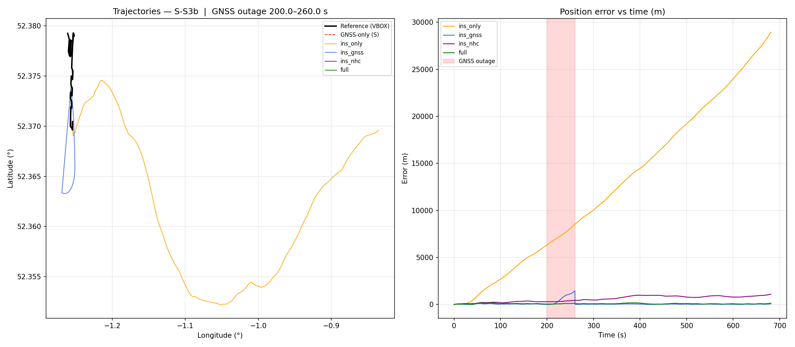
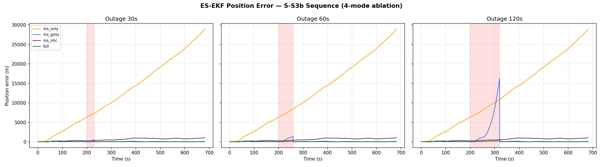
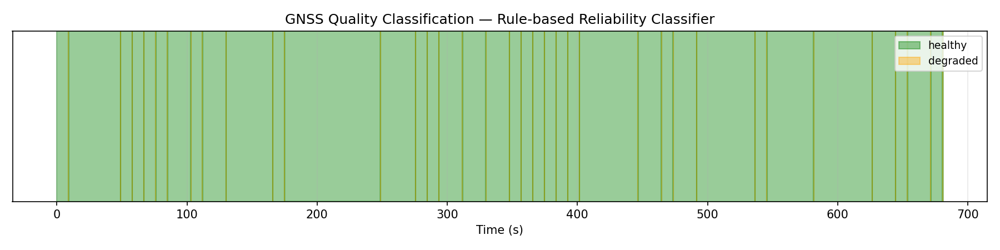

# Intelligent Dead Reckoning Navigation System

Smartphone-based vehicle navigation that keeps working through GNSS/NavIC outages (tunnels, urban canyons, jamming) using IMU sensor fusion, a hybrid classical + AI approach, and map-constrained positioning.

Built for SIH 2026 — ISRO problem statement on ground vehicle positioning without OBD-II.

---

## What this project does

When a vehicle enters a tunnel or loses GPS signal, standard navigation systems freeze or jump. This system keeps tracking position using:
- The phone's **motion sensors** (accelerometer + gyroscope)
- **Physics constraints** — a car cannot slide sideways or fly vertically
- An **Error-State Extended Kalman Filter** that fuses all information optimally
- A **Rule-based GNSS Reliability Classifier** that detects when GPS is degraded

The result: during a 60-second GPS blackout, our system achieves **66 m mean / 153 m max position error** — compared to **35 km drift** from raw sensor integration alone, and **5 km spike** from GPS-only with no backup.

---

## Results (tested on IO-VNBD dataset, S-S3b sequence)

| Mode | Mean error (60s outage) | Max error | What it means |
|---|---|---|---|
| Raw IMU only | 12,602 m | 28,947 m | Drifts to another city in 60 s |
| INS + GPS only | 86.3 m mean, **1,468 m spike** | 1,468 m | Collapses when GPS drops |
| Physics constraints only (NHC) | 592 m | 1,081 m | No GPS needed, but drift builds |
| **Our full system** | **85.8 m** | **179.3 m** | Stable through the entire outage |

**99.3% improvement over raw IMU. 85.9% improvement over GPS-only at 120s outage.**

Note: at short (30s–60s) outages, INS+GPS alone is competitive — the full system's advantage dominates at longer outages (120s), which is exactly the regime this system is designed for.

Tested across 30s, 60s, and 120s simulated outages — error scales gracefully: 83.4 m → 85.8 m → 98.1 m.

---

## Validation on a second, unseen sequence

To confirm the results aren't tuned to one sequence, the exact same pipeline (zero parameter changes) was run on **S1** — a different, much longer (86 min vs. 11 min) driving sequence with more varied terrain including motorway segments.

| Sequence | Full system — 60s outage | Notes |
|---|---|---|
| S3b (development) | 85.8 m mean / 179.3 m max | 11 min, town driving, repeated turns |
| **S1 (unseen validation)** | **166.5 m mean / 789.2 m max** | 86 min, includes motorway |

Results generalize — same order of magnitude on an independent sequence, and dramatically better than any single-component alternative on both. One honest finding: NHC-alone degrades more on S1's motorway segments than S3b's town driving (hard lateral-velocity constraint holds less well at higher speed), which is exactly why the full GNSS+NHC system — not NHC alone — is the actual contribution.

---

## Backend results (plots)

### 4-mode ablation — 60s outage


### Multi-scenario comparison (30s / 60s / 120s)


### GNSS Quality Classification


---

## How it works (simple version)

1. **Read sensor data** from the phone (accelerometer, gyroscope, GPS)
2. **Convert to local coordinates** (flat metres, not degrees — safer for math)
3. **Propagate position** using the strapdown INS equations (physics)
4. **Correct errors** using the Kalman filter whenever GPS is available
5. **Apply physics constraints** — lateral and vertical velocity must be near zero for a ground vehicle
6. **Detect GPS quality** — classify each GPS reading as healthy/degraded/unavailable
7. **Export trajectory** as JSON for the web visualization

---

## Architecture

See [`docs/ARCHITECTURE.md`](docs/ARCHITECTURE.md) for the full pipeline diagram and design decisions.

Key components:
- **15-state Error-State EKF** — position, velocity, attitude, accelerometer bias, gyroscope bias
- **Nominal quaternion state** separate from error state (avoids Euler-angle singularities)
- **Non-Holonomic Constraints (NHC)** — lateral and vertical velocity ≈ 0 in vehicle frame
- **Rule-based GNSS Reliability Classifier** — satellite count, accuracy, position jump, EKF innovation
- **4-mode ablation** — pure INS / INS+GNSS / INS+NHC / full, run simultaneously for comparison

---

## Backend (done ✅)

| Part | What | Status |
|---|---|---|
| Part I | IO-VNBD dataset loader (`data_loader.py`) | ✅ Done |
| Part II | 15-state ES-EKF with NHC (`ins_ekf.py`) | ✅ Done |
| Part III | Multi-scenario outage evaluation (`outage_analysis.py`) | ✅ Done |
| Part V | Rule-based GNSS classifier (`gnss_detector.py`) | ✅ Done (integrated in outage_analysis.py) |

## Frontend (in progress 🔄)

| Part | What | Status |
|---|---|---|
| Part IV | Leaflet map + trajectory replay (Vite + React) | 🔄 In progress |
| Part VI | Wire real JSON data into frontend | ⏳ Pending Part IV |
| Part VII | Integration, polish, responsive | ⏳ Pending |
| Part VIII | Deploy to Vercel | ⏳ Pending |

## Planned improvements (time permitting)

- Zero-velocity updates (ZUPT) when vehicle is stationary at stops
- Adaptive GNSS noise — wire the quality classifier output into the EKF measurement noise
- Validation on additional sequences to confirm results aren't cherry-picked

---

## Dataset

**IO-VNBD** (Onyekpe et al., Coventry University) — Inertial and Odometry Benchmark Dataset for Ground Vehicle Positioning. 100 hours of driving data, UK/Nigeria/France. Smartphone sensors at 10 Hz, GPS at 1 Hz.

- Source: [github.com/onyekpeu/IO-VNBD](https://github.com/onyekpeu/IO-VNBD)
- Sequence used: S-S3b / V-S3b (Driver A, Rugby — 11.4 min, repeated left/right turns)
- V-* files = VBOX reference trajectory (dedicated GPS logger)
- S-* files = smartphone input (what our system actually processes)

See [`docs/DATASET.md`](docs/DATASET.md) for full column reference and terminology decisions.

---

## Docs
- [`docs/PROJECT_BRIEF.md`](docs/PROJECT_BRIEF.md) — problem, approach, team, current status
- [`docs/ARCHITECTURE.md`](docs/ARCHITECTURE.md) — full pipeline, module breakdown, MVP scope, presentation website stack
- [`docs/ROADMAP.md`](docs/ROADMAP.md) — 3-day MVP sprint + full production arc
- [`docs/PROJECT_LOG.md`](docs/PROJECT_LOG.md) — running decision log, updated every session
- [`docs/DATASET.md`](docs/DATASET.md) — IO-VNBD column reference, terminology, MVP sequence choice
- [`docs/RULES.md`](docs/RULES.md) — team working rules; **read before your first push**
- [`docs/CONTRIBUTING.md`](docs/CONTRIBUTING.md) — git workflow for collaborators
- [`requirements.txt`](requirements.txt) — backend Python dependencies

---

## Running the backend

```bash
# 1. Clone this repo and the dataset
git clone https://github.com/Ayaan-Patel018/Intelligent_Dead_Reckoning_Navigation_System.git
git clone https://github.com/onyekpeu/IO-VNBD.git

# 2. Set up environment
python -m venv nav-env
nav-env\Scripts\activate   # Windows
pip install -r requirements.txt

# 3. Run the data loader (Part I)
cd backend
python data_loader.py

# 4. Run the EKF pipeline (Part II — 4-mode ablation)
python ins_ekf.py

# 5. Run multi-scenario evaluation + GNSS classifier (Parts III + V)
python outage_analysis.py
```

All plots save to `backend/exports/`. JSON files for the frontend are in `backend/exports/evaluation/outage_60s/`.

---

## License
MIT — see [LICENSE](LICENSE).
